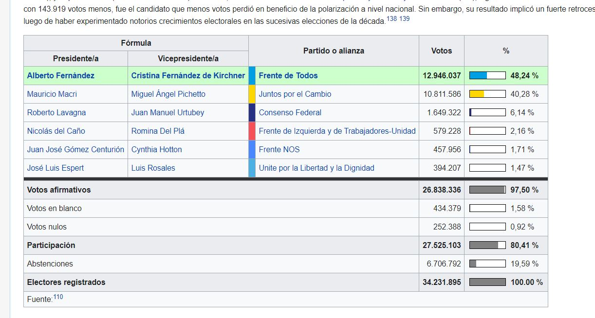

En este post mostraremos los datos que utilizamos, e introduciremos dos subsecciones que permiten seguir los pasos que hicimos para obtenerlos.

Antes de comenzar, abrimos algunas librerías.

```{r, message=FALSE, warning=FALSE}
library(tidyverse) # trabajaremos en el paradigma "tidy"
library(rtweet) # para leer datos desde Twitter
library(readxl) # para leer datos desde excel
library(gt) # para formatear tablas
```


## Nuestra base

Comencemos por presentar sintéticamente los datos elejidos para trabajar. 
Como dijimos, nos interesaba explorar el desempeño y los discursos de los candidatos al poder ejecutivo en las elecciones argentinas de 2019 -un país federal, que incluye cargos ejecutivos electivos a diversos niveles. 
En este marco, y dado nuestro fin experimental y exploratorio, decidimos quedarnos con los siguientes datos: 

1. De los candidatos a la Presidencia (6 candidatos en total)
2. De candidatos a Gobernador conforme al siguiente recorte:
    + Seleccionamos 4 provincias que oficiaron elecciones "simultáneas" (al mismo tiempo que en el nivel nacional), y 4 provincias que realizaron elecciones "desdobladas", (antes que en el nivel nacional) pero en una única fecha. 
    + Nos quedamos con los candidatos que llegaron al primer y segundo puesto. 
    
Nuestra base quedó conformada de la siguiente manera:

```{r, message=FALSE, warning=FALSE}
datos_base <- read_xlsx("datos_base.xlsx")

datos_base %>% 
  gt() %>% 
  gt::tab_header(
    title = "Datos Utilizados",
    subtitle = "TuitsArg2019") %>% 
  gt::tab_style(
    style=  cell_fill(color = "#00BFFF", alpha = 0.5),
    locations = cells_title(groups = c("title", "subtitle"))) %>% 
  gt::tab_style(
    style= cell_text(
  color = "#0515A2",
  align = "center",
  v_align = "middle",
  weight = "lighter"),
  locations = cells_body())
```


## Datos Electorales

Para "explorar la popularidad" de los candidatos (como veremos en la [sección correspondiente](/post/explorando_popularidad/)), debimos colectar datos sobre los resultados electorales. 

Para eso desarrollamos [este script](https://github.com/CVFH/Tuits_arg_2019/blob/master/preparacion_datos_electorales.R) que explicamos en [este post](/post/preparacion_datos_electorales/). El código define una función que parte de enlaces de wikipedia y/o de la Dirección Nacional Electoral argentina, y devuelve una tabla de datos _tidy_.

Por ejemplo, partimos del enlace: 
[https://es.wikipedia.org/wiki/Elecciones_presidenciales_de_Argentina_de_2019](https://es.wikipedia.org/wiki/Elecciones_presidenciales_de_Argentina_de_2019)

...que contiene la siguiente tabla:



Extrajimos de esta manera los datos:

```{r, message=FALSE, warning=FALSE}

# Primero, llamamos al script que diseñamos
source("preparacion_datos_electorales.R", encoding = "UTF-8")

# Llamamos a una función para obtener los datos presidenciales, 
# asignando el parámetro correspondiente ("presid")
votos_presid <- traerDatosElectorales("presid")

# Tenemos nuestros datos!

votos_presid %>% 
  gt() %>% 
  gt::tab_header(
    title = "Elecciones presidenciales Argentina 2019",
    subtitle = "Resultados") %>% 
  gt::tab_style(
    style=  cell_fill(color = "#00BFFF", alpha = 0.5),
    locations = cells_title(groups = c("title", "subtitle"))) %>% 
  gt::tab_style(
    style= cell_text(
  color = "#0515A2",
  align = "center",
  v_align = "middle",
  weight = "lighter"),
  locations = cells_body())

```


## Datos de tuiter

Una vez identificadas las cuentas de nuestro interés, nos ocupamos de traer los datos de los tuits emitidos con _rtweet_. 

Por ejemplo, para @[alferdez](https://twitter.com/alferdez), utilizamos el comando
`tuits_alferdez <- get_timeline("alferdez")`. Con esto, obtenemos una tabla (aprox) como la siguiente: 

```{r, eval = TRUE, echo = FALSE}
tuits_alferdez <- read_xlsx("alferdez.xlsx")
```


```{r, message=FALSE, warning=FALSE}

head(tuits_alferdez)

```

El default de `get_timeline` trae los últimos 100 tuits. Como máximo, las normas de Twitter permiten extraer 3.200 tuits. Dado que este límite implica que la fecha de los tuits que obtenemos con el llamado va cambiando con el tiempo, nosotros optamos por guardar estas bases de datos en archivos .csv, a los que se puede acceder desde [este enlace a nuestro repositorio de Git](https://github.com/CVFH/Tuits_arg_2019/tree/master/Data).

Por este mismo motivo es que desarrollamos una funcion que agrega y emprolija estos datos en [este script](https://github.com/CVFH/Tuits_arg_2019/blob/master/preparacion_datos_tuits.R) que explicamos en [este post](../../post/preparacion_datos_tuits/), de manera similar a como hicimos con los datos electorales.

## A trabajar!

Una vez obtenidas nuestras tablas electorales y los datos de Twitter, podemos jugar, explorar, ensayar un análisis, algo que haremos en los posts que siguen.

#### probando


referencia {{ pattern "explorando_palabras" }} aca
